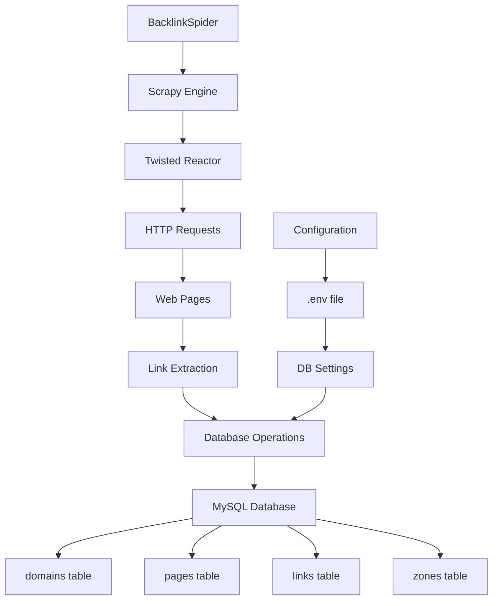
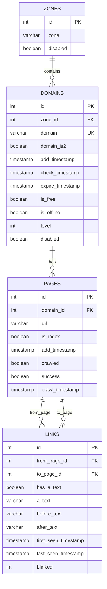

# 🕷️ Web Crawler & Backlink Collector

[](https://python.org)
[](https://scrapy.org)
[](https://mysql.com)
[](LICENSE)

> **Профессиональный веб-краулер для сбора backlink'ов и анализа связей между доменами**

## 📋 Содержание

- [🎯 Описание](#-описание)
- [🏗️ Архитектура](#️-архитектура)
- [🗄️ База данных](#️-база-данных)
- [⚡ Быстрый старт](#-быстрый-старт)
- [🔧 Установка](#-установка)
- [📖 Использование](#-использование)
- [📊 Анализ проекта](#-анализ-проекта)
- [⚠️ Известные проблемы](#️-известные-проблемы)
- [🚀 Рекомендации по улучшению](#-рекомендации-по-улучшению)
- [🤝 Вклад в проект](#-вклад-в-проект)

## 🎯 Описание

Этот проект представляет собой мощный веб-краулер, разработанный для сбора backlink'ов между веб-сайтами. Система использует асинхронную архитектуру на базе Scrapy и Twisted для эффективного сканирования интернета, начиная с заданного набора seed-доменов.

### ✨ Основные возможности

- 🔍 **Асинхронный краулинг** - Высокопроизводительное сканирование с использованием Scrapy
- 🗃️ **Структурированное хранение** - MySQL база данных с оптимизированной схемой
- 🔗 **Анализ backlink'ов** - Детальное отслеживание связей между доменами
- 📊 **Мониторинг изменений** - Отслеживание появления/исчезновения ссылок
- 🌐 **Поддержка зон** - Категоризация доменов по типам (.com, .org, .ru и др.)
- ⚡ **Модульная архитектура** - Легко расширяемая и поддерживаемая кодовая база

## 🏗️ Архитектура



### 🔧 Компоненты системы

| Компонент | Описание | Технология |
|-----------|----------|------------|
| **Spider Engine** | Основной движок краулинга | Scrapy + Twisted |
| **Database Layer** | Слой работы с данными | MySQL + mysql-connector |
| **Configuration** | Управление настройками | python-dotenv |
| **Link Parser** | Извлечение ссылок | CSS селекторы |
| **Data Storage** | Хранение результатов | MySQL InnoDB |

## 🗄️ База данных

### 📊 Схема базы данных



### 📋 Описание таблиц

#### 🏷️ `zones` - Зоны доменов
Категоризация доменов по типам (TLD):
- `.com`, `.org`, `.net` - коммерческие
- `.gov`, `.edu` - государственные/образовательные  
- `.ru`, `.ua`, `.in` - национальные

#### 🌐 `domains` - Домены
Основная таблица для хранения информации о доменах:
- **Статусы**: `is_offline`, `is_free`, `disabled`
- **Временные метки**: добавление, проверка, истечение
- **Уровень краулинга**: глубина сканирования

#### 📄 `pages` - Страницы
Информация о конкретных веб-страницах:
- **URL**: полный адрес страницы
- **Статусы краулинга**: `crawled`, `success`
- **Тип**: главная страница или внутренняя

#### 🔗 `links` - Ссылки (Backlinks)
Связи между страницами с контекстом:
- **Anchor text**: текст ссылки
- **Контекст**: текст до и после ссылки
- **Мониторинг**: отслеживание изменений (`blinked`)

## ⚡ Быстрый старт

### 🚀 Запуск за 3 шага

```bash
# 1. Клонирование и настройка
git clone <repository>
cd legacy/crawler

# 2. Установка зависимостей
chmod +x script/install.sh
./script/install.sh

# 3. Настройка и запуск
cp script/template.env .env
# Отредактируйте .env файл с вашими настройками БД
chmod +x script/start.sh
./script/start.sh
```

## 🔧 Установка

### 📦 Зависимости

```bash
pip install scrapy python-dotenv mysql-connector-python
```

### ⚙️ Конфигурация

Создайте файл `.env` в корне проекта:

```env
DB_HOST=localhost
DB_USER=your_username
DB_PASS=your_password
DB_NAME=crawler
```

### 🗄️ Настройка базы данных

```bash
# Импорт схемы
mysql -u your_username -p your_database < sql/crawler.sql

# Или без комментариев
mysql -u your_username -p your_database < sql/crawler_no_comnets.sql
```

## 📖 Использование

### 🎮 Основные команды

```bash
# Запуск краулера
python3 script/scrap

# Или через скрипт
./script/start.sh

# Обновление кода
./update.sh
```

### 📝 Примеры использования

#### Добавление новых доменов

```sql
INSERT INTO domains (zone_id, domain, level) 
VALUES (9, 'example.com', 1);
```

#### Просмотр собранных backlink'ов

```sql
SELECT 
    d1.domain as from_domain,
    d2.domain as to_domain,
    l.a_text,
    l.first_seen_timestamp
FROM links l
JOIN pages p1 ON l.from_page_id = p1.id
JOIN pages p2 ON l.to_page_id = p2.id
JOIN domains d1 ON p1.domain_id = d1.id
JOIN domains d2 ON p2.domain_id = d2.id
ORDER BY l.first_seen_timestamp DESC;
```

## 📊 Анализ проекта

### ✅ Сильные стороны

- **🏗️ Хорошая архитектура**: Модульная структура с разделением ответственности
- **⚡ Асинхронность**: Использование Scrapy + Twisted для высокой производительности
- **🗃️ Продуманная БД**: Оптимизированная схема с индексами и связями
- **📊 Мониторинг**: Отслеживание изменений в ссылках
- **🌐 Масштабируемость**: Поддержка различных зон доменов

### ⚠️ Области для улучшения

- **🔒 Безопасность**: SQL-инъекции в некоторых местах
- **📝 Логирование**: Недостаточно детальное логирование
- **🛡️ Обработка ошибок**: Нужна более robust обработка исключений
- **⚡ Производительность**: Отсутствует connection pooling
- **🎯 Функциональность**: Ограниченный краулинг (только главные страницы)

## ⚠️ Известные проблемы

### 🐛 Критические

1. **SQL Injection** в `db_operations.py`:
   ```python
   # ПРОБЛЕМА: Уязвимость к SQL-инъекциям
   query = f'SELECT id FROM domains WHERE domain = "{domain}";'
   ```

2. **Connection Management**: Отсутствует proper connection pooling

3. **Error Handling**: Недостаточная обработка сетевых ошибок

### ⚠️ Важные

1. **Rate Limiting**: Отсутствует ограничение скорости запросов
2. **JavaScript Content**: Не обрабатывается динамический контент
3. **Robots.txt**: Не учитываются правила robots.txt
4. **User-Agent**: Стандартный User-Agent может блокироваться

## 🚀 Рекомендации по улучшению

### 🔒 Безопасность

```python
# ✅ ИСПРАВЛЕНИЕ: Использование параметризованных запросов
def get_page_id(domain):
    query = "SELECT id FROM domains WHERE domain = %s;"
    cursor.execute(query, (domain,))
```

### ⚡ Производительность

```python
# ✅ РЕКОМЕНДАЦИЯ: Connection pooling
from mysql.connector import pooling

config = {
    'pool_name': 'crawler_pool',
    'pool_size': 10,
    'pool_reset_session': True,
    **DB_SETTINGS
}
```

### 🎯 Функциональность

1. **Глубокий краулинг**: Следование по внутренним ссылкам
2. **Content Analysis**: Извлечение мета-данных страниц
3. **Duplicate Detection**: Предотвращение дублирования
4. **Resume Capability**: Возможность возобновления работы

### 📊 Мониторинг

```python
# ✅ РЕКОМЕНДАЦИЯ: Расширенное логирование
import logging

logging.basicConfig(
    level=logging.INFO,
    format='%(asctime)s - %(name)s - %(levelname)s - %(message)s',
    handlers=[
        logging.FileHandler('crawler.log'),
        logging.StreamHandler()
    ]
)
```

## 🤝 Вклад в проект

### 🔄 Workflow

1. **Fork** репозитория
2. **Создайте** feature branch (`git checkout -b feature/amazing-feature`)
3. **Commit** изменения (`git commit -m 'Add amazing feature'`)
4. **Push** в branch (`git push origin feature/amazing-feature`)
5. **Откройте** Pull Request

### 📋 Стандарты кода

- **PEP 8** для Python кода
- **Документация** для всех функций
- **Тесты** для новой функциональности
- **Логирование** для отладки

### 🐛 Сообщение об ошибках

При сообщении об ошибке укажите:
- Версию Python и Scrapy
- Описание проблемы
- Шаги для воспроизведения
- Логи ошибок

---

## 📄 Лицензия

Этот проект распространяется под лицензией MIT. См. файл [LICENSE](LICENSE) для подробностей.

## 👥 Авторы

- **Anton** - *Изначальная разработка* - [@mozgach108](https://github.com/mozgach108)

## 🙏 Благодарности

- [Scrapy](https://scrapy.org/) - за отличный фреймворк для веб-краулинга
- [Twisted](https://twistedmatrix.com/) - за асинхронную обработку
- [MySQL](https://mysql.com/) - за надежную базу данных

---

<div align="center">

**⭐ Если проект был полезен, поставьте звезду! ⭐**

[🔝 Наверх](#-web-crawler--backlink-collector)

</div>